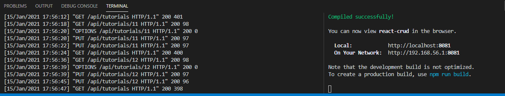
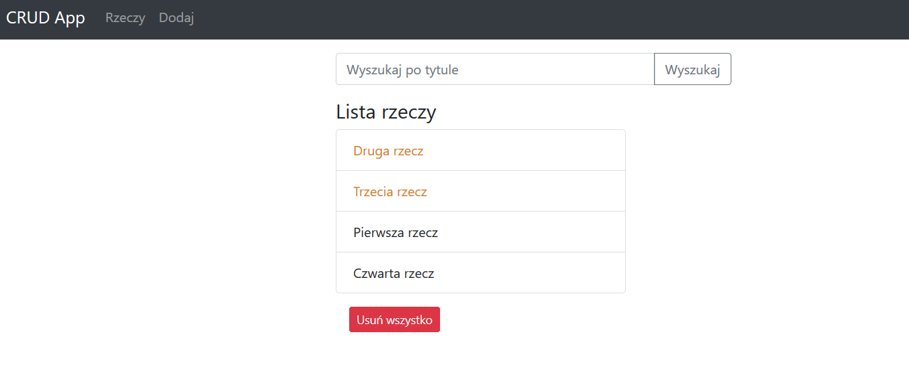
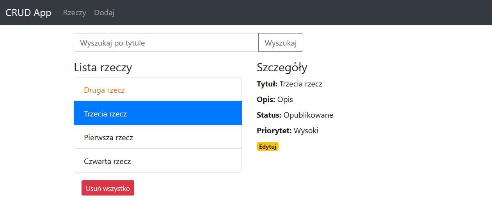
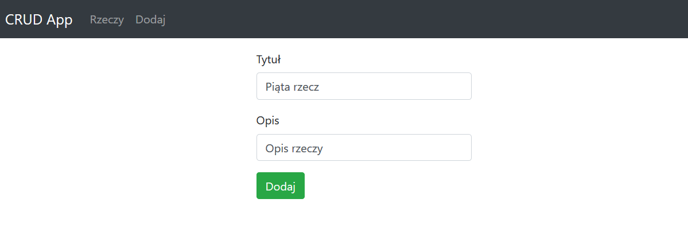
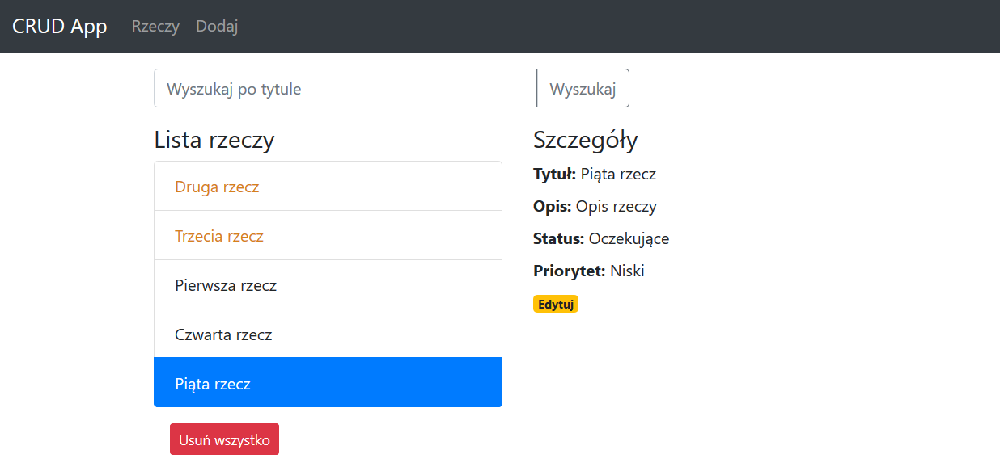
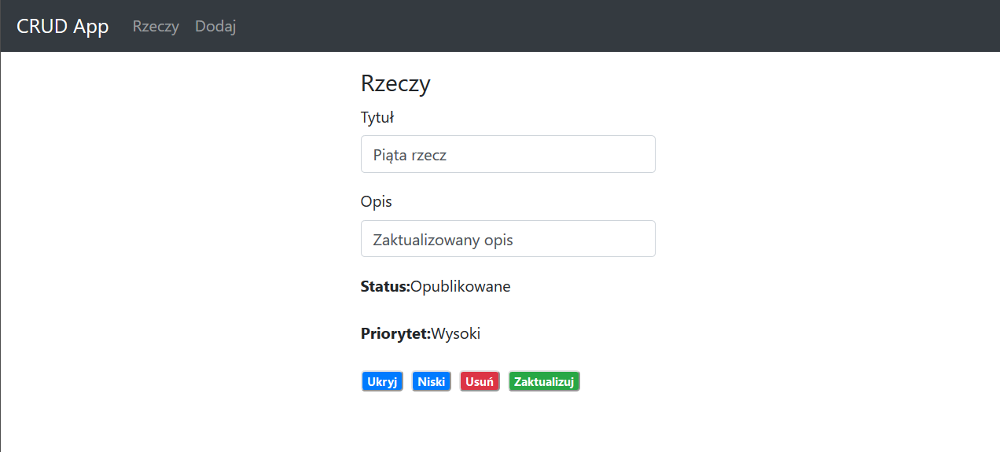
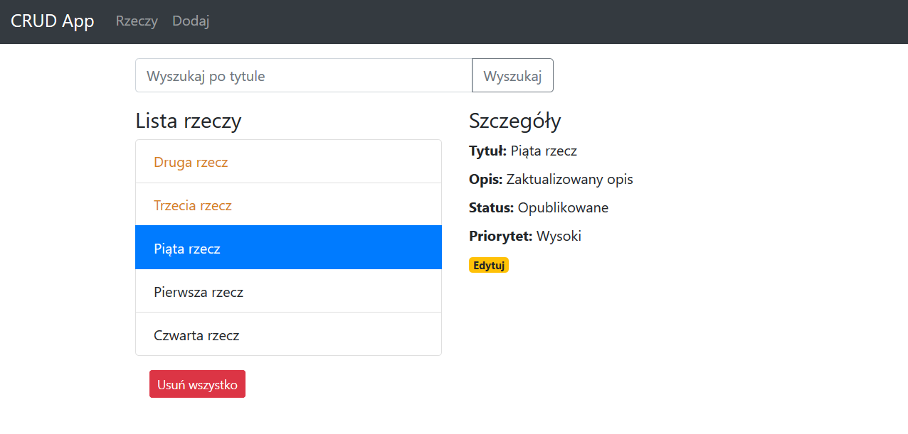

# Laboratorium numer 9

Laboratorium miało na celu napisanie aplikacji typu CRUD z backendem zrealizowanym w Django oraz frontendem zrealizowanym za pomocą React.js.

W ramach realizacji zadania przeanalizowano, wdrożono oraz zmodyfikowano kod dodając priorytet rzeczy i sortując je wg. priorytetu [poradnika](https://bezkoder.com/django-react-axios-rest-framework/).

## Zrealizowana aplikacja:

Backend + frontend:

Lista rzeczy:

Lista rzeczy + szczegóły:

Dodawanie rzeczy:

Dodana rzecz:

Edycja rzeczy:

Lista po edycji:

